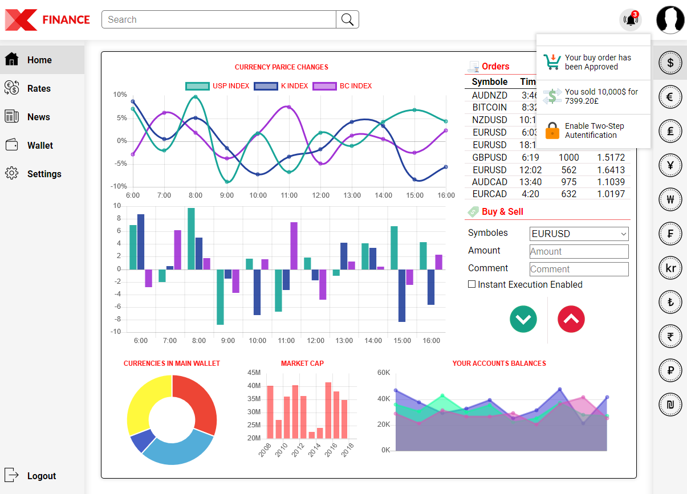

# financeWebAppInterface
Non Functional Web App (Design)

### intro
this is for "IHM" module L3 ..
the goal is to make an intuitive interface for a software in a certain domain
my choice was "Finance"

### TechUsed
* HTML/CSS
* JS
* JQuery
* Chart.js

## Report
in French, included with the project files ...

